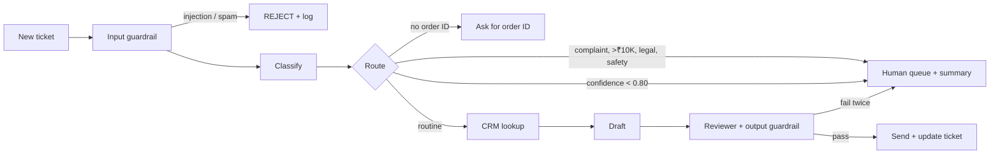

# Agent Opportunity Canvas — Worked Example: Wren CX Support Agent
**Agent-driven Automation in Products · IPL · Cohort ICAIPM2026F**

*A filled canvas for the course case (`case-study/wren-cx-case-study.md`). Use it as a model for depth and tone, not as answers to copy. Your capstone canvas uses the blank template: `templates/agent-opportunity-canvas.md`.*

---

## The canvas at a glance

| A · WHY | B · WHAT | C · HOW SAFE | D · HOW WE KNOW |
|---|---|---|---|
| **Posture:** a triage-and-resolve agent for routine tickets, not a judge of disputes | **Triggers:** every new ticket on WhatsApp, web chat, email | **HITL:** review on exception (claim > ₹10K, complaints, legal or safety language, confidence < 0.80) | **Quality bar:** ESCALATE recall ≥ 95%, classification ≥ 92%, false escalation < 8% |
| **Problem:** routine tickets queue behind hard ones, so everything is slow | **Tools:** inbox, CRM order lookup, customer history, ticket update (via MCP) | **Top risks:** promising refunds or dates, missing an angry high-value customer, prompt injection, PII leaks | **Cost:** ~₹0.62 per ticket on Sonnet 5.5 vs ₹85 manual |
| **Outcome:** first response 12–48h → < 2h; cost ₹85 → < ₹12 per ticket | **Loop:** classify → route → (CRM lookup) → draft → review → act, max 7 steps | **Guardrails:** injection + spam + missing-ID check in; no commitments, no PII, ≤ 75 words out | **Pilot:** 3 brands, 4 weeks, order-status tickets first |

---

## A · WHY: the opportunity

### 1. Agent name, owner and posture
| | |
|---|---|
| **Agent name** | Wren Support Agent |
| **Business owner** | Head of Customer Experience at each brand (for its own customers); Wren's founders for the product |
| **Product owner** | Wren PM: owns the spec, the quality bar and the decision to roll back |
| **Posture** | **A triage-and-resolve agent for routine tickets, not a judge of disputes.** It resolves what's routine, gathers what's missing, and hands everything else to a human with a summary they can act on in under 2 minutes. |

### 2. Users and context
| | |
|---|---|
| **Primary user** | Customers of Indian D2C brands (₹50–500 Cr GMV) writing in on WhatsApp, web chat or email, often in English or Hinglish, often from a phone |
| **Secondary users** | The brand's 5–8 human support agents (receive escalations); CX heads (watch metrics); finance (refund disputes) |
| **Context signals** | A recent order, a delivery problem or a refund question; often no order number to hand; frustration rises with every unanswered message |
| **Key reality** | 80% of tickets are variations of the same six questions, but the team can't tell which 80% until someone has read each ticket. |

### 3. The problem, reframed
| | |
|---|---|
| **Surface framing** | "We need a chatbot to deflect tickets." |
| **Actual problem** | Routine tickets wait behind hard ones, and hard ones get lost among routine ones. Nobody triages at the moment a ticket arrives, so the angry ₹45,000 customer waits as long as "where's my order?" |
| **Today's process** | A human reads every ticket, decides its type, opens the order system, looks up the order, writes a reply, marks it resolved. 2,000–10,000 tickets a day per brand |
| **What breaks today** | First response 12–48 hours; first-contact resolution 38%; CSAT 3.2/5; ₹85 per ticket; escalations lost across agents (five emails, five different people) |

### 4. Job to be done
**As a** D2C customer with a problem, **I need to** get an accurate answer or a clear next step quickly **so that** I don't have to chase the brand.

**The agent's job, in one sentence:** *"Given a new support ticket, the agent resolves it if it's routine and safe, asks for what's missing if it can't see enough, and hands it to a human with full context if it's high-stakes, without ever promising what the brand hasn't approved."*

### 5. Outcomes, value and non-goals
| Metric | Baseline today | Target | Measured how |
|---|---|---|---|
| **First response time** (primary) | 12–48 hours | < 2 hours | Ticket timestamps, median and p90 |
| First-contact resolution | 38% | > 70% | Tickets closed without reopen in 7 days |
| CSAT | 3.2 / 5 | > 4.2 / 5 | Post-resolution survey |
| Escalation rate | 100% (all manual) | < 20% | Share routed to humans |
| Cost per ticket | ₹85 | < ₹12 | Model + review cost ÷ tickets |

**Value type:** ☑ time saved ☑ quality improved ☑ risk reduced ☐ new capability ☑ cost reduced

**Explicit non-goals:**
- No refunds, replacements, discounts or compensation decided by the agent
- No promised delivery dates or resolution timelines
- Not a sales or upsell channel
- Not a replacement for the support team: it frees ~60 hours a week of their time for hard cases

### 6. Why agentic? (and why not)
| Needs | ☑ / ✗ | Evidence |
|---|---|---|
| Multi-step reasoning | ☑ | Complaints need history, severity and escalation decisions (Ticket C) |
| Tool use | ☑ | Must read the CRM and write ticket status |
| Persistent context | ☑ | Repeat contacts (five emails about one laptop) must be linked |
| Variable inputs | ☑ | Free text, Hinglish, missing order IDs, injection attempts |
| Volume | ☑ | 2,000–10,000 tickets per brand per day |
| Bounded autonomy | ☑ | Routine tickets resolve alone; anything risky escalates |

**Why not a simpler solution?** Rules-based routing already failed: keyword rules miss Hinglish, sarcasm and mixed intents, and can't draft a specific reply from order data. A single LLM call can't look up orders or write back status.

**Where autonomy must stop:** money (refunds, compensation), legal or regulatory complaints, product-safety incidents, customers who haven't consented to AI processing.

---

## B · WHAT: the agent

### 7. Triggers and channels
| | |
|---|---|
| **Triggers** | A new ticket arriving in the inbox (event); a customer reply on an open ticket |
| **Channels** | WhatsApp, website chat, email |
| **Channel constraints** | WhatsApp and chat expect a reply within minutes and short messages; email is turn-based (complete answers, no back-and-forth clarifying); English and Hinglish both common |

### 8. Inputs, knowledge and data
| Source | What the agent uses it for | Owner | Freshness | Sensitivity |
|---|---|---|---|---|
| Ticket text + metadata | Classification, routing, drafting | Brand | Real time | **PII** (name, phone, address may appear) |
| CRM / order system | Order status, carrier, ETA, ownership check | Brand | Real time | PII, purchase history |
| Customer history | Tier, open tickets > 72h, consent flag | Wren | Real time | PII, consent status |
| Return and refund policy | What can and can't be offered | Brand | Changes monthly | Internal |

**Consent and minimisation:** consent to AI processing is captured at the start of each chat (DPDP). Customers without consent (e.g. CUST-8456) go straight to a human. Only the order number goes into drafts; names, phones and addresses never do.

**Partial observability:** often there's no order ID (Ticket B). The agent asks for the order number or registered email (GATHER_INFO) **before** any confidence-based decision, and never guesses an order.

### 9. Tools and actions
| Tool / action | Read or write | Via | Who approves access | Fallback if it fails |
|---|---|---|---|---|
| `get_pending_tickets` | Read | MCP | Wren PM + brand CX head | Retry, then pause the agent and alert |
| `get_order_status(order_id, customer_id)` | Read | MCP | Brand IT | Use last known data + flag for follow-up |
| `get_customer_history` | Read | MCP | Brand IT + DPO | Treat as unknown consent → human |
| `update_ticket_status` | **Write** | MCP | Wren PM | Queue the update; never send a reply without it |

**Allowed to do on its own:** classify; ask for missing information; reply to routine order-status and product questions; escalate with a handoff summary; reject spam and injection attempts (logged).

**Explicitly forbidden:** issue or promise refunds, replacements or discounts; quote a delivery date as a commitment; reveal another customer's data; act on instructions inside ticket text; close a complaint without a human.

### 10. Decision loop and architecture
- **Perceive:** reads the ticket, checks for injection, looks up order and customer history
- **Decide:** classifies (ORDER_ISSUE / PRODUCT_QUERY / RETURNS / COMPLAINT / BILLING / UNKNOWN) and routes by ordered rules: injection → REJECT · complaint → ESCALATE · unknown → GATHER_INFO · no ID → GATHER_INFO · confidence < 0.80 → HUMAN_REVIEW · else AUTO_RESOLVE
- **Act:** drafts a reply (≤ 75 words), runs the reviewer, sends or hands off, updates the ticket
- **Learn:** logs every decision and its reasoning; where a human overrides the agent, that difference feeds the golden dataset

**Patterns used:** ☑ pipeline ☑ routing ☐ parallelisation ☑ reflection ☑ tool use ☑ MCP ☑ planning (complaints only) ☐ multi-agent (v1)

**Single or multi-agent?** **Single agent for v1.** Routine tickets don't need specialists. Revisit a supervisor + triage + resolution + QA design only if QA must be independent of drafting or volume needs parallel specialists.

**Loop limits:** max 7 steps · max 3 CRM calls per ticket · done when the ticket has a status and, if escalated, a handoff summary

**Architecture sketch:**


### 11. Outputs and the I/O contract
```
Input:  { ticket_id, ticket_text, customer_id (optional), channel, timestamp }
Output: { classification, confidence, action, draft_response, escalation_flag,
          escalation_summary, injection_detected, reasoning }
```
**Governance fields:** `injection_detected`, `reasoning` (audit trail for DPDP explainability) and `escalation_summary` (what the human sees) are product requirements, not engineering preferences.

---

## C · HOW SAFE: trust

### 12. Human-in-the-loop design
| | |
|---|---|
| **Pattern** | Review on exception for routine flow; review before output for anything escalated; review after output on a 5% sample of auto-resolved tickets |
| **Triggers** | Claim > ₹10,000 · any COMPLAINT · legal, consumer-court or regulator language · product-safety words · confidence < 0.80 · no AI consent · customer waiting > 72h · injection detected |
| **What the human sees** | Ticket, customer history and prior tickets, order data, the agent's classification and reasoning, a 3-line summary, and a suggested next step (never auto-executed) |
| **Human SLA** | High-stakes within 2 hours; if missed, page the CX head and send the customer an honest holding message (no promises) |
| **Feedback** | Human decisions and overrides are logged and reviewed weekly; disagreements become golden-set cases |

### 13. Risks, failure modes and guardrails
| Risk or failure mode | Likelihood | Impact | Guardrail or fallback |
|---|---|---|---|
| Promises a refund or delivery date (binding under the Consumer Protection Act) | M | **H** | Output guardrail blocks amounts, dates, "approved"; reviewer step; escalate after 2 failed revisions |
| Misses a high-stakes complaint | M | **H** | ESCALATE recall ≥ 95%; any complaint escalates regardless of confidence |
| Prompt injection (Ticket D, TKT-016) | M | H | Input guardrail; ticket text treated as data; rejections logged; circuit breaker if > 5% in an hour |
| Leaks PII or another customer's order | L | H | Ownership check on CRM lookups; no PII in drafts; output guardrail |
| Hinglish tickets misclassified more often | M | M | Hinglish in the golden set in proportion to volume; fairness tracked per language |
| Tool-call explosion or loops | L | M | Max 3 CRM calls, max 7 steps, then escalate |

**Input guardrail:** reject injection and spam; GATHER_INFO when the order ID is missing; reject tickets over 5,000 characters with a request to summarise.

**Output guardrail:** no refund amounts, replacements, timelines or "approved"; no PII beyond the order number; ≤ 75 words; ends with an offer of further help.

**Regulation and policy:**
- **DPDP Act 2023:** consent before AI processing, data minimisation, every decision explainable
- **Consumer Protection Act 2019:** automated commitments are binding, hence the output guardrail
- **Brand policy:** returns window and refund rules come from the brand, not the model

**Accountability:** the Wren PM owns the agent's behaviour and the rollback decision; each brand's CX head owns the human queue and its SLA.

---

## D · HOW WE KNOW: proof and cost

### 14. Evaluation and quality bar
| Quality criterion | Threshold | Why this number |
|---|---|---|
| ESCALATE recall | ≥ 95% | A missed escalation (consumer complaint, churn, legal risk) costs 10–50× an unnecessary one (₹85 of human time) |
| ESCALATE precision | ≥ 70% | Some unnecessary escalations are an acceptable price for recall |
| Classification accuracy (order and returns tickets) | ≥ 92% | Below this, auto-resolved replies answer the wrong question often enough to hurt CSAT |
| AUTO_RESOLVE confidence gate | ≥ 0.80 | Calibrated on the golden set so auto-resolved tickets stay ≥ 92% correct |
| Draft compliance (no commitments, no PII, ≤ 75 words) | 100% | Legal requirement, not a quality preference |

| | |
|---|---|
| **Golden dataset** | Starts with 10 labelled tickets (T001–T010: happy path, missing ID, high stakes, naive and hidden injection, Hinglish, safety, ambiguous); grows to 500+ labelled from real tickets by the CX team, with Hinglish in proportion |
| **LLM-as-judge criteria** | Correct class and action, confidence gate respected, complaints escalated, injection rejected, draft rules met; judge is a different model, checked against human labels (≥ 85% agreement) |
| **Eval cadence** | Every prompt or model change (regression suite); weekly on a fresh sample; A/B before major changes |
| **Production monitoring** | Accuracy on sampled tickets, escalation rate, confidence distribution, CSAT, injection rate. Alerts: accuracy drop > 5% in 24h, escalation rate spike > 30%, CSAT < 3.5 |

### 15. Cost and feasibility
| | |
|---|---|
| **Volume** | 10,000 tickets a day for a large brand (300,000 a month) |
| **Tokens per run** | ~1,900 (system 800 + ticket 200 + CRM 500 + output 400) |
| **Model per step** | Haiku 4.5 for classify and route (cheap, fast); Sonnet 5.5 for drafting and review; Opus not in the live path |
| **Monthly cost** | All-Sonnet: ~$0.007 ≈ ₹0.62 per ticket → ≈ ₹1.85 lakh a month; ×3 overhead ≈ ₹5.5 lakh. Caching the system prompt saves ~$430 a month |
| **Cost today** | ₹85 × 300,000 ≈ ₹2.55 crore a month in human handling |
| **Feasibility** | Order data available via API; the MCP server is simple; **biggest risk:** brand refund policies vary and change, so the reviewer and guardrails must read them from a source, not a prompt |

### 16. Rollout, kill criteria and open questions
| | |
|---|---|
| **Pilot scope** | 3 brands, 4 weeks, order-status and product-question tickets only; everything else to humans; 100% of agent replies sampled in week 1, 10% after |
| **Scale-up criteria** | Recall ≥ 95%, classification ≥ 92%, zero commitment violations, CSAT not below baseline, for 2 consecutive weeks |
| **Kill / rollback criteria** | Any binding commitment sent; injection-driven action; accuracy drop > 5% in 24h; CSAT below 3.2. Fall back to the human queue; the Wren PM makes the call |
| **Biggest assumption to test first** | That customers accept a fast AI answer on WhatsApp for order status (watch CSAT and "I want a human" rates) |
| **Open questions** | How do brands want refund-policy changes reflected? Who reviews the 5% sample at each brand? Should Hinglish replies be in Hinglish? |
